# Software Engineering 1

## Course 00 - Setup

For the following courses you need to have

1) **Java 17** installed on your computer
2) **VsCode** installed on your computer
3) **Maven** installed on your computer

### Install Java 17, Maven and Visual Studio Code for the Home-Office

***IMPORTANT: SKIP THIS STEP IF YOU ARE CODING ON A COMPUTER OF THE UNIVERSITY OF APPLIED SCIENCES DUESSELDORF RIGHT NOW!!!***

<details>
<summary>WINDOWS</summary>

- Winget for Windows 10 users: [LINK](https://www.microsoft.com/en-us/p/app-installer/9nblggh4nns1#activetab=pivot:overviewtab) (winget is installed in Windows 11 by default)   
- Java Open JDK 17
  - Either via installer: [Adoptium Open JDK installer](https://adoptium.net/)
  - Or via winget (system-wide by default):
      ```powershell
      winget install EclipseAdoptium.Temurin.17.JDK
      ```
- Visual Studio Code
  - Either via installer: [Visual Studio Code Installer](https://code.visualstudio.com/)
    1) Download the vscode installer [from the official website.
      ](https://code.visualstudio.com/)

      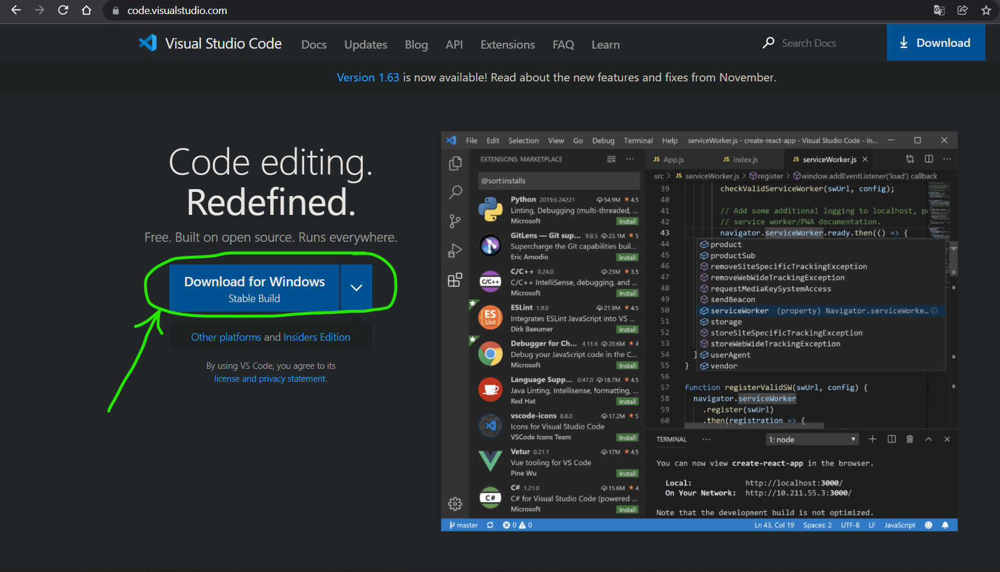

    2) Locate the vscode installer on your computer (for example in Downloads)
       
       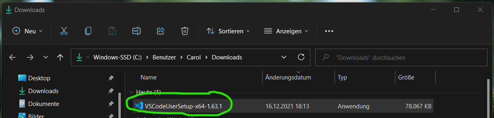

    3) Run the vscode installer
       
       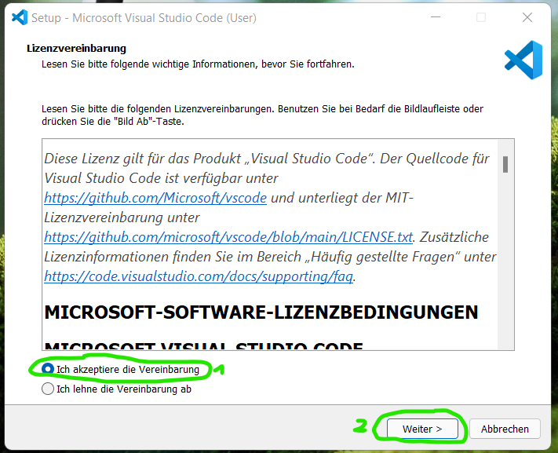

       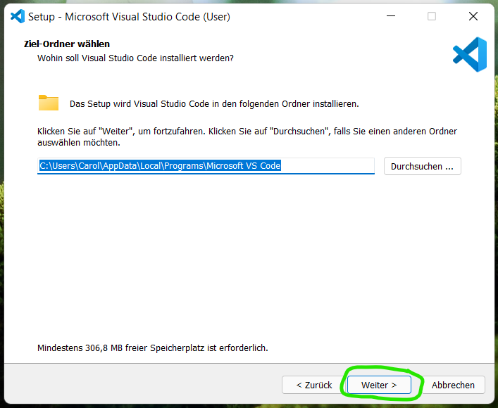

       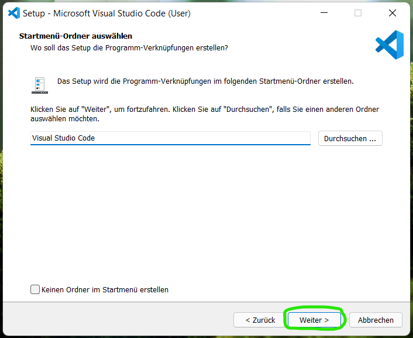

       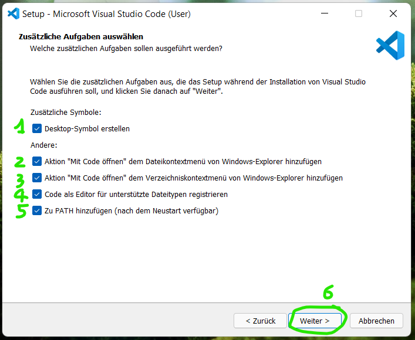

       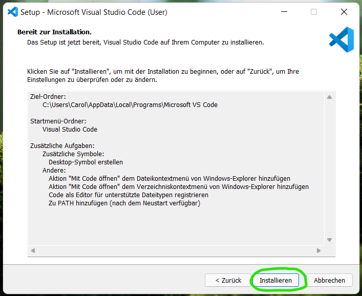

       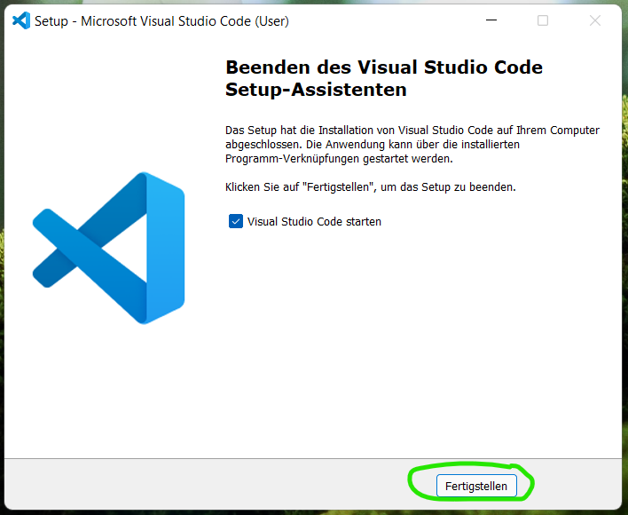
  - Or with winget system-wide:  
    ```
    winget install Microsoft.VisualStudioCode --scope machine
    ```
  - Or with winget as a user-only installation:  
    ```powershell
    winget install Microsoft.VisualStudioCode
    ```
- [VSCode Java extension pack](https://marketplace.visualstudio.com/items?itemName=vscjava.vscode-java-pack)
- [VSCode Spring Boot extension pack](https://marketplace.visualstudio.com/items?itemName=Pivotal.vscode-boot-dev-pack)
- Gluon Scene Builder
  - Either via installer: [Gluon Scene Builder Installer](https://gluonhq.com/products/scene-builder)
  - Or with winget (user only):
      ```powershell
      winget install Gluon.SceneBuilder
      ```
- [Maven](https://maven.apache.org/install.html)
  - open powershell as administrator (right-click: open as administrator) and run:
      ```powershell
      Set-ExecutionPolicy Bypass -Scope Process -Force; [System.Net.ServicePointManager]::SecurityProtocol = [System.Net.ServicePointManager]::SecurityProtocol -bor 3072; iex ((New-Object System.Net.WebClient).DownloadString('https://community.chocolatey.org/install.ps1'))
      ```
  - Once the installation is completed, close the Powershell (Admin) or Terminal (Admin) and open it again and run:        
      ```powershell
      choco install maven
      ```
</details>

<details>
<summary>MACOS</summary>

- Homebrew (If wanted)
  - If wanted you can use homebrew to complete the following installation steps. [Homebrew](https://brew.sh) is a unofficial package manager for macOS, which should help you with installing new software on your system. To get started with homebrew just paste the following command inside your terminal window:
    ```
    /bin/bash -c "$(curl -fsSL https://raw.githubusercontent.com/Homebrew/install/HEAD/install.sh)"
    ```

- Java Open JDK 17
  - Either via installer: [Adoptium Open JDK installer](https://adoptium.net/)
  - Or via brew:
    ```
    brew install --cask temurin
    ```
- Visual Studio Code
  - Either via installer: [Visual Studio Code Installer](https://code.visualstudio.com/)
    1. Download the vscode App [from the official website.](https://code.visualstudio.com/)
    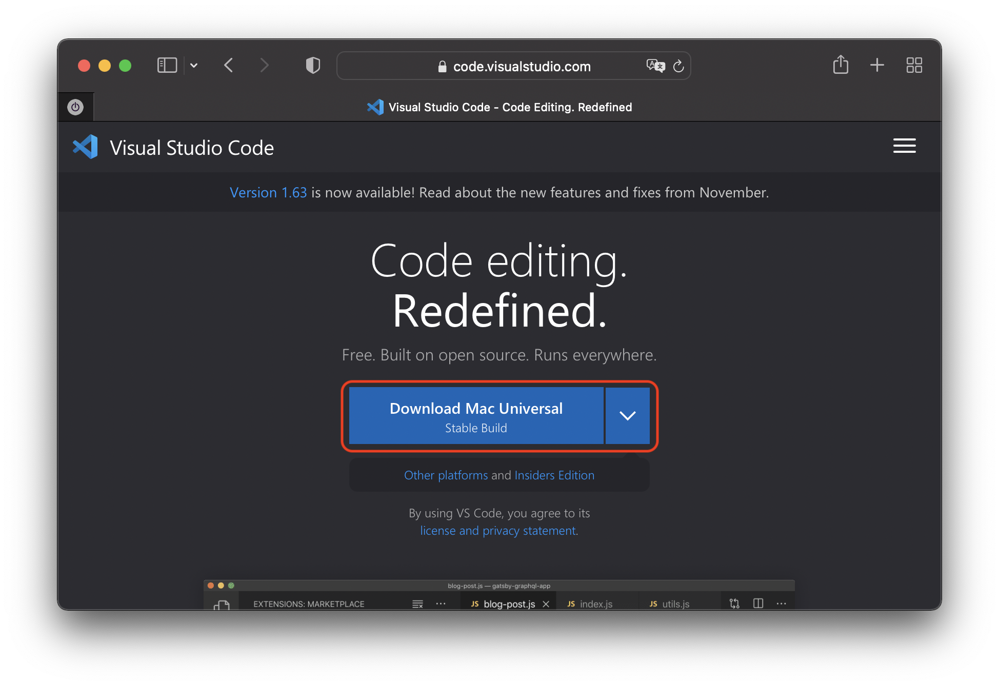

    2. Install the app on your system. Simply drag and drop the downloaded `*.app` file into your Applications folder.
    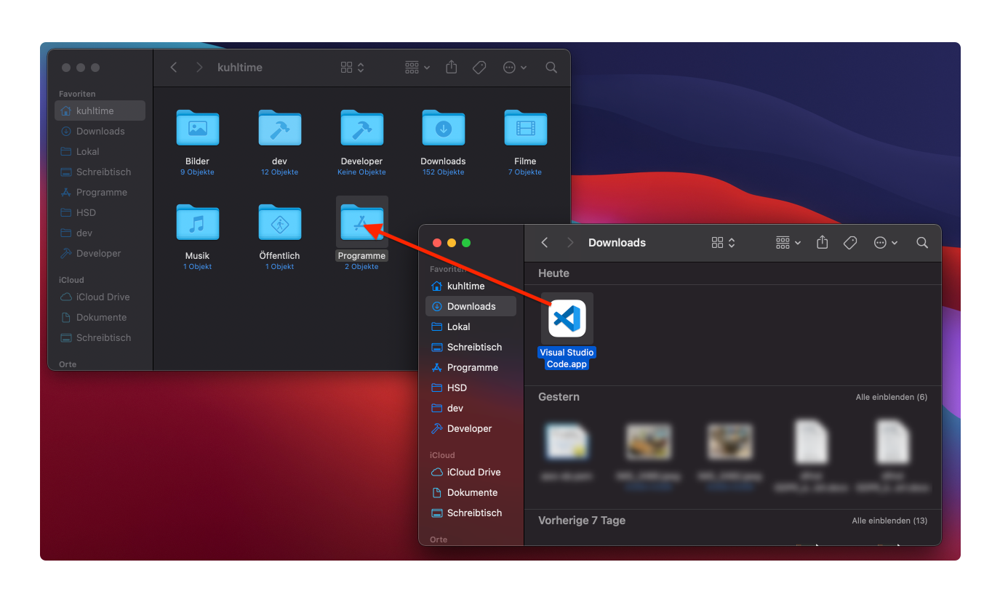
  - Or via brew:  
    ```
    brew install --cask visual-studio-code
    ```
- [VSCode Java extension pack](https://marketplace.visualstudio.com/items?itemName=vscjava.vscode-java-pack)
- [VSCode Spring Boot extension pack](https://marketplace.visualstudio.com/items?itemName=Pivotal.vscode-boot-dev-pack)
- Gluon Scene Builder
  - Either via installer: [Gluon Scene Builder Installer](https://gluonhq.com/products/scene-builder)
  - Or via brew:
    ```
    brew install --cask scenebuilder
    ```
- Maven
  - Either manually using these setup instructions: [Maven - Installing](https://maven.apache.org/install.html)
  - Or via brew:
    ```
    brew install maven
    ```
</details>


<details>
<summary>UBUNTU</summary>

- Java Open JDK 17
  ```bash
  sudo apt install openjdk-17-jdk
  ```
- Visual Studio Code
  - Either via installer: [Visual Studio Code Installer](https://code.visualstudio.com/)
  - Or via snap:  
    ```bash
    sudo snap install code --classic
    ```
- [VSCode Java extension pack](https://marketplace.visualstudio.com/items?itemName=vscjava.vscode-java-pack)
- [VSCode Spring Boot extension pack](https://marketplace.visualstudio.com/items?itemName=Pivotal.vscode-boot-dev-pack)
- Gluon Scene Builder
  - via installer: [Gluon Scene Builder Installer](https://gluonhq.com/products/scene-builder)
  - or via terminal:
    ```bash
    wget https://download2.gluonhq.com/scenebuilder/17.0.0/install/linux/SceneBuilder-17.0.0.deb
    sudo dpkg -i SceneBuilder-17.0.0.deb
    ```
- [Maven](https://maven.apache.org/install.html) 
  ```bash
  sudo apt install maven
  ```
</details>

### Setup VsCode

1) Click on the "Extension" Icon in the left panel
   
   

2) search for `java extension pack` in the search field click on the first entry (NOTE: check that the distributor is MICROSOFT and no-one else) and click on the `Install` button to installer the extension pack. Wait until all extensions are installed.
   
   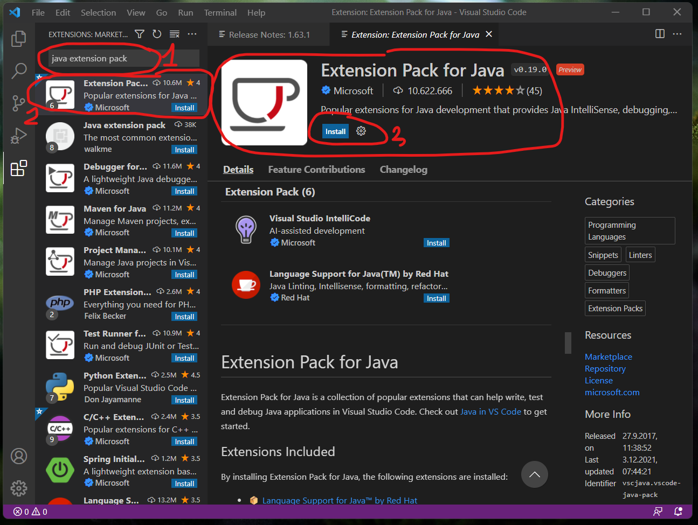
   
   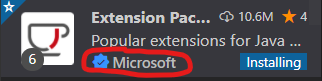


### How-to use vscode for Java development

#### Create a simple java project

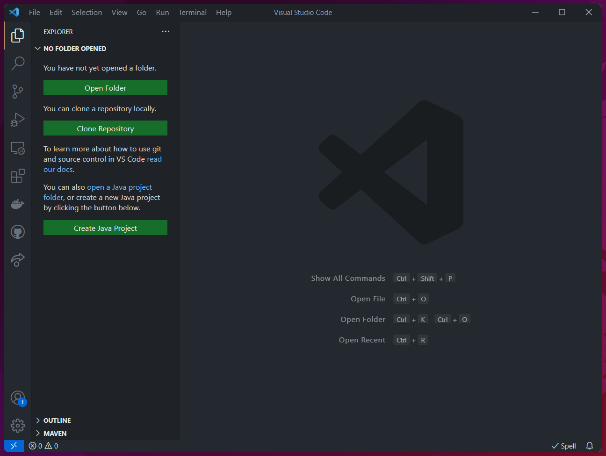

#### Create a maven project

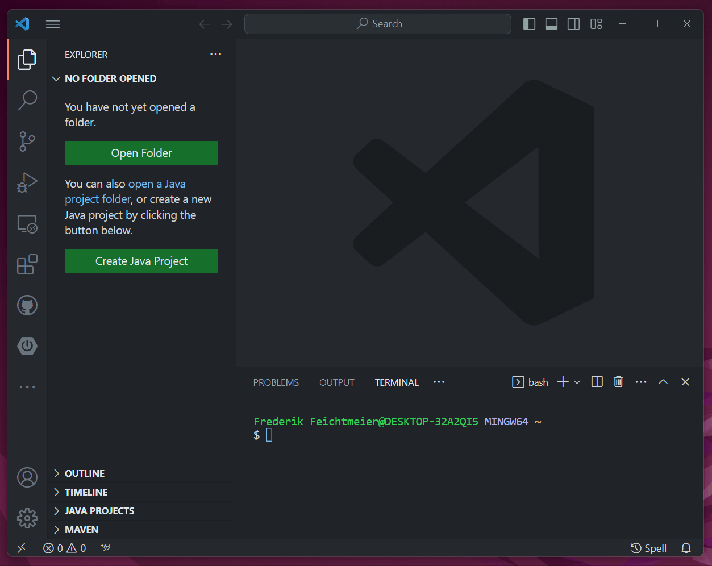

______

**ATTENTION:** When you are inside the HSD laboratory room safe ALL your work on the `H:\` drive!!!

## Course 01

<details>
<summary> MacOS Users only - CLICK TO EXPAND </summary>

Please make sure to follow these steps to "downgrade" your TextEdit to save simple java files:

- on the menu bar on the top left corner of your screen, click on TextEdit, then Preferences.
- In the New Document tab, change the document format to Plain Text under the Format section. Uncheck the Smart quotes box under the Options section towards the bottom of the preference window.
- Switch to the Open and Save tab. Change the Opening files and Saving files to Unicode (UTF-8).
- Close the TextEdit application and re-open it. Open a new document.

</details>

### Task overview

1. Create, compile and run a simple "Hello World" java application.
2. Use the Eclipse "Hello World tutorial" to get used to Eclipse *Java* Projects.
3. Create, compile and run a java application with a simple JavaFX graphical user interface with Eclipse via a *Maven* Project

### Tasks

#### Task 1 - Simple "Hello-Java-App"

1. Let your file explorer show file extensions to safe files with the correct `.java` file extension:

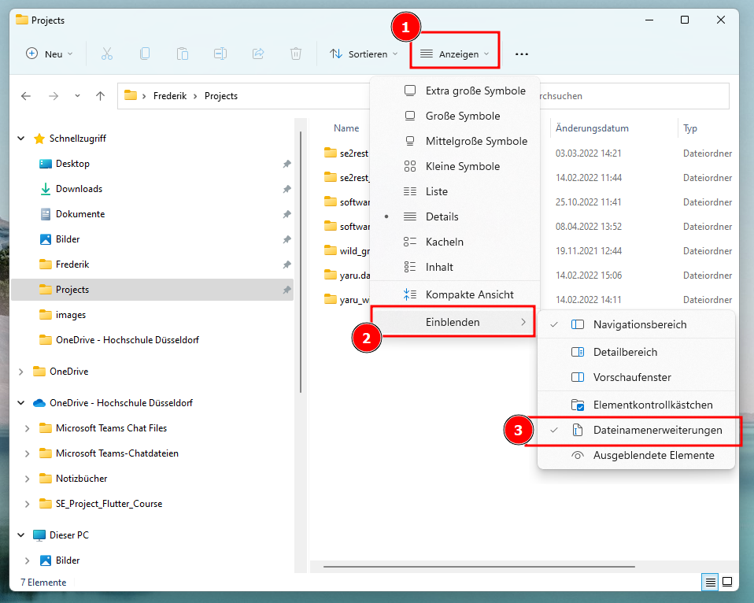

2. Open a simple text editor (Windows Notepad, Ubuntu Gedit or MacOs TextEdit) enter the following code and save it as ```Hello.java``` to your desired location:
    ```java
    public class Hello {
        public static void main(String args[]) {
            System.out.println("Hello Java");
        }
    }
    ```
3. Open a command line interface (Windows: Windows-Key + R -> Type `Cmd.exe`, press enter, Ubuntu: CTRL + SHIFT + T, MacOs: search for `Terminal`) and navigate to the location where you saved your Java Code with:
    ```bash
    cd PATH_TO_YOU_FILE
    ```

    NOTE: For Windows drives like `C:` or `H:` you just enter...

    ```
    H:
    ```
    **without the `cd` command**

    ... to change to this location.

4. Type ```javac Hello.java``` and press enter
5. Now the java code has been compiled to ```Hello.class``` which you can run from within your terminal with:
    ```java
    java Hello
    ```

#### Task 2 - Basic Java App

1. Create a new Java Project without build tools by...

    EITHER clicking on the "Create Java project" button in the explorer view of VsCod *(considering you have no directory currently opened, otherwise this button won't show up)*, selecting "No builds tools", choosing a directory to create the project in and name it `se1c1`

    

    OR by opening the VsCode command palette and typing  *Java: Create Java Project*, selecting "No builds tools", choosing a directory to create the project in and name it `se1c1`

    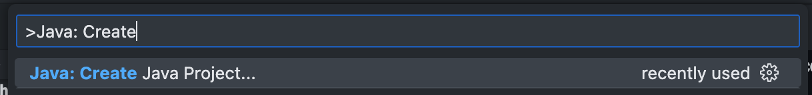

2. VsCode should have created the file `App.java` for you
3. Change `App.java` to include
   1. a `main` Method (should be already inside)
   2. inside the `main` method
      1. create the variable `eineZahl` of the type `int`
      2. create the variable `nochEineZahl` of the type `int`
      3. create the variable `eineKommaZahl` of the type `double`
      4. create the variable `eineZeichenKette` of the type `String`
   3. outside of the `main` method, but inside `App`
      1. a `static` method `addieren` with two parameters (also called "arguments") of the type `int`, for example `a` and `b`, that returns the addition of `a` and `b`
      2. a `static` method `dividieren` with two parameters of the type `double`, for example `a` and `b`, that returns `a` divided by `b`
      3. a `static` method `ggt` (größter, gemeinsamer Teiler) that calculates the greatest common divisor of the two `int` variables `a` and `b`
         1. constraint: use recursion
   4. call `addieren` with `a:eineZahl` and `b:nochEineZahl` and save the result in the variable `summe`
   5. call `dividieren` with `a:eineKommaZahl` and `b:summe` and save the result in the variable `quotient`
   6. Use the method `System.out.println` to print out `eineZeichenKette + quotient` to the integrated terminal in VsCode
   7. call `ggt` with `a:eineZahl` and `b:nochEineZahl` and use `System.out.println` to print the result to the terminal
   8. Explain why `addieren` and `dividieren` need to be declared as `static`
   9. (OPTIONAL) Change `addieren` the arguments to `int... zahlen`, declare and initialize the variable `int summme = 0` inside the method body of `addieren` and iterate of the provided arguments with a for-loop to add each argument to `summe` and finally return `summe` at the end

## Course 02: Calculator

### Tasks
1. Create a new java project without build tools like in [Course 01, Task 2](#task-2---basic-java-app)
2. Copy the code of `App.java` of [Course 01, Task 2](#task-2---basic-java-app) into your new `App.java`
3. (OPTIONAL) Additionally, add the following `static` methods inside `App`
   1. multiplizieren
   2. sin(x)
   3. x^y
4. Display a menu to the terminal which displays one option for each of your methods. For example:
    ``````
    CALCULATOR - please select:
    0: Programmende
    1: addieren
    2: dividieren
    3: multiplizieren
    4: sin(x)
    5: x^y
    ``````
5. Read in user input in the terminal
6. Display what parameters should now be provided by the user
7. Read in user input for each parameter the selected methods requires  (if you improved the parameters in `addieren` to `int... zahlen` you need to define a "stop" character like `s` for stop)
8. Run the selected method and display the result in the terminal

## Course 03 - OOP Intro

*Note: (Currently German only)*

### Overview: "Einstieg in die Objektorientierung"
Die Klassen Kfz und Lkw werden erstellt, wobei die
Grundprinzipien der Objektorientierung sukzessive einfließen. Dies bedeutet, dass wir mit
einer "schlechten" Klasse KfzV0 anfangen und diese ständig verbessern, bis wir schließlich
eine "schöne" Klasse Kfz erhalten.
Hierzu werden im Folgenden zwei Arten von Klassen erstellt. KfzV0, Kfz und Lkw sollen zur
Instanziierung von Objekten dienen und lediglich Attribute besitzen und Methoden zur
Verfügung stellen.
Die Demo-Klassen sollen genutzt werden, um einzelne Instanzen der Kfz Klassen zu
erzeugen. Diese sollen eine main-Methode enthalten und somit ausführbar sein.

1. Erstellen Sie das neue **Java Projekt** `se1c3`.
2. Erstellen Sie sukzessive (nacheinander) die Klassen `KfzV0`, `Kfz` und `Lkw`:
   - Implementieren Sie die Klasse `KfzV0` mit den öffentlichen Integer-Attributen
   `sitze` und `tankInhalt` und dem öffentlichen Float-Attribut `verbrauch`.
3. Implementieren Sie das Programm `KfzDemo.java` mit einer main-Methode:
   - Das Objekt `minivan` wird von der Klasse `KfzV0` erzeugt.
   - Die Attribute werden mit `sitze = 6`, `tankInhalt = 70`, `verbrauch = 14` initialisiert.
   - Die mögliche Reichweite bei vollem Tank wird ausgerechnet und mit
   `System.out.println` ausgegeben.
4. Erstellen Sie die Datei `ZweiKfz.java` und kopieren sie den Inhalt von `KfzDemo.java` hinein, außerdem:
   - Zusätzlich zum `minivan` Objekt wird ein Objekt `sportwagen` von der Klasse `KfzV0` erzeugt.
   - Die Attribute von `sportwagen` werden mit `sitze = 2`, `tankInhalt = 45`, `verbrauch = 11` initialisiert.
   - Die mögliche Reichweite von `sportwagen` bei vollem Tank wird ausgerechnet und mittels `System.out.println` ausgegeben.
5. Erweitern Sie die Klasse `KfzV0` um die Methode `reichweite()`, die die Reichweite als Rückgabewert liefert.
6. Erstellen Sie die Datei `ReturnDemo.java` und kopieren sie den Inhalt von `ZweiKfz.java` hinein, zusätzlich:
   - Die Ausgabe der Reichweite erfolgt in der main-Methode, wobei die Methode
   reichweite() genutzt wird.
7. Die Klasse `KfzV0` wird um die Methode `spritVerbrauch(int km)` erweitert.
   - Die Methode hat als Eingabeparameter eine Entfernung in Kilometern.
   - Sie berechnet den entsprechenden Spritverbrauch für die Entfernung.
   - Der Spritverbrauch wird als float-Ergebnis zurückgegeben.
8. Erstellen Sie die Datei `SpritDemo.java` und kopieren Sie den Inhalt von `ReturnDemo.java` hinein, außerdem:
   - Die Methode spritVerbrauch wird in der main-Methode für die Entfernung 252 km aufgerufen und die Ergebnisse für die beiden Instanzen ausgegeben.
9.  Erstellen Sie die Klasse `Kfz` und kopieren Sie den Inhalt von `KfzV0.java` hinein. Die neue Klasse `Kfz` wird um die Konstruktor-Methode `Kfz(int sitze, int tankInhalt, float verbrauch)` erweitert. Zusätzlich werden alle Attribute auf `private` gesetzt.
10. Erstellen Sie die Datei `KonstruktorDemo.java` und kopieren Sie den Inhalt von `SpritDemo.java` hinein, außerdem:
    - Die Attribute werden über den Konstruktor `Kfz` initialisiert.
11.  Die Klasse Lkw wird von `Kfz` abgeleitet (Vererbung):
    - Sie hat die beiden zusätzlichen Attribute `int ladeFlaeche` und `boolean hatAnhaenger`.
    - Der Konstruktor `Lkw` initialisiert alle Attribute.
    - Die Lkw-Methode `spritVerbrauch` addiert immer einen Liter zum errechneten Verbrauch hinzu.
12. Implementieren Sie das Programm `LkwDemo.java` mit:
    - Einem Objekt `sportWagen` der Klasse `Kfz` und ein Objekt `magirus` der Klasse
    `Lkw`.
    - Das magirus-Objekt hat die gleichen Attribute wie das sportwagen-Objekt (nur
    zur Demo).
    - Weisen Sie der zusätzlichen Referenz-Variable `kfz` der Klasse Kfz (keine Instanziierung)
    nacheinander `sportWagen` und `magirus` zu und geben Sie jeweils den Verbrauch auf 252 km aus.
    
## Course 04 - JavaFX Calculator

### Topic

A calculator app made with JavaFX.

### Tasks

1. Create the Maven project ```se1c4``` by using the archetype `javafx-archetype-simple` from `org.openjfx` to create a **JAVA FX** (not Swing!) appliction

    

2. add the following dependency to your `pom.xml` file:
   
    ```xml
    <dependency>
        <groupId>net.objecthunter</groupId>
        <artifactId>exp4j</artifactId>
        <version>0.4.8</version>
    </dependency>
    ```
3. Add the following line to your `module-info.java`

    ```
    requires exp4j;
    ```
4. Create a calculator UI inside `App.java` with the following JavaFX UI classes:
   1. `HsdButton` extends `Button`
      1. set the min width and size to 50
      2. set the background color to be white
      3. create the class inside a new file `HsdButton.java`
   2. `TextField`
   3. `GridPane`
   4. `BorderPane`
5. Make sure you import the **correct* UI classes from JavaFX! Not from AWT or Swing!
6. Use `ExpressionBuilder` and `Expression` to calculate the result and display it in the UI

### Possible result

*Note: (feel free to adapt and improve the design, add more buttons or use css to improve the styling)*

